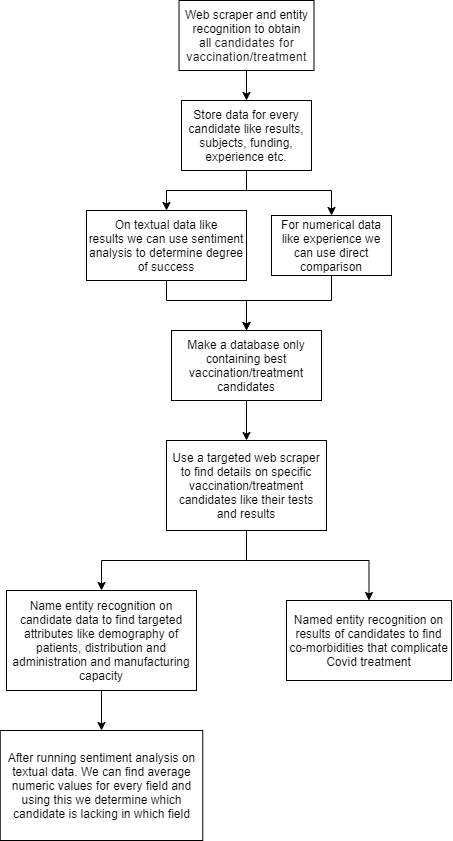

# Data Pipeline

- Web scraper used in both cases can be made using Beautiful Soup library.
- For sentiment analysis, we can use a fine-tuned BERT model to determine a clinical trial's degree of success.
- Named entity recognition model will have to be trained separately for both cases:
    - First case, will focus on getting data like number of patients, nature of patients, money (funding), experience of the company. This will be used to identify the best candidates for vaccination/treatment.
    - Second case, will focus on getting results, manufacturing capacity, demography data like race, gender etc. and distribution details. This will be used to answers questions 2 and 3.
- There will be two databases:
    - First one will contain all candidates and some information about them which will be used to find the best candidates.
    - Second one will contain only the best candidates and extensive information about these which will be used to find co-morbidities and the lacking fields for every candidate.

 

